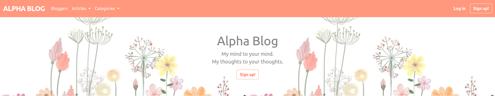
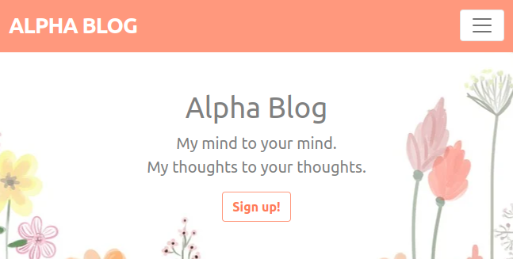
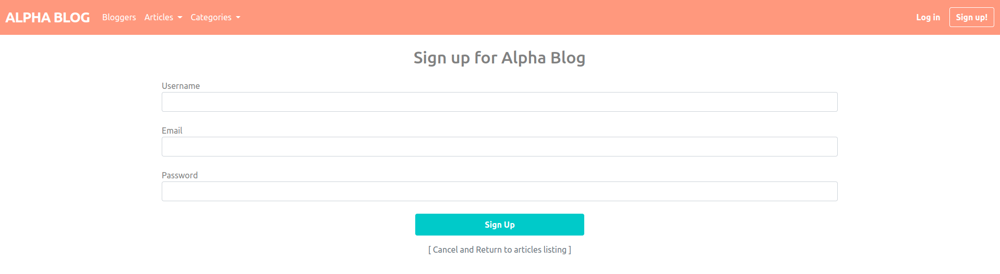
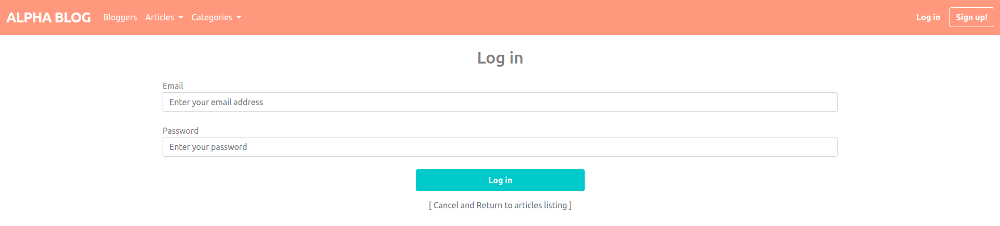
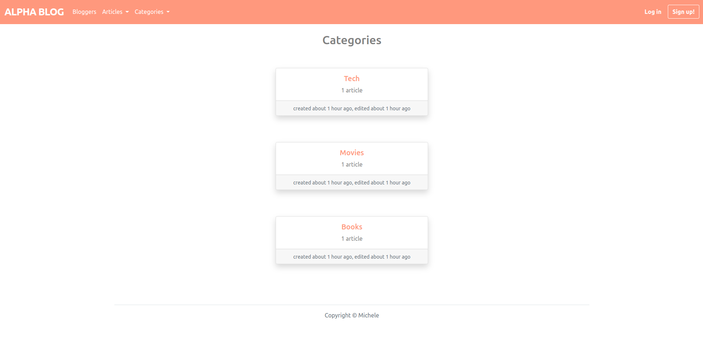
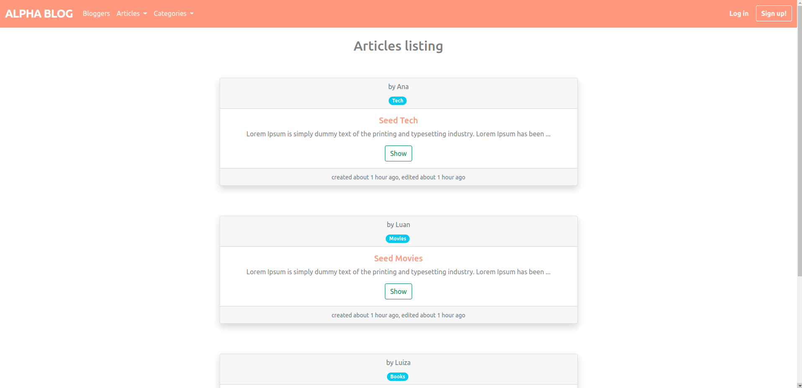
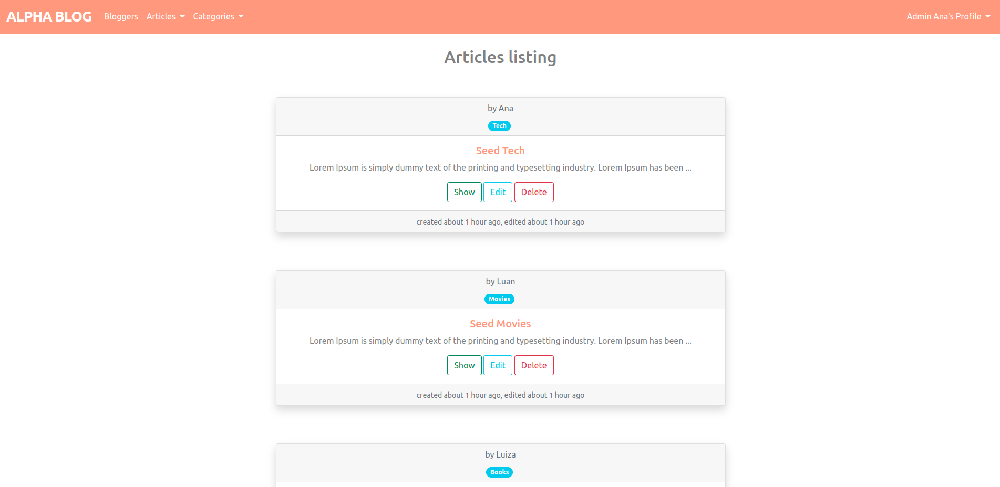

## About the project

Alpha Blog project from 'The Complete Ruby on Rails Developer Course' of Mashrur Hossain on Udemy.

<br>

## This project includes
- Tables for users, articles and categories.
- Many-to-many association for articles and categories;
- One-to-many association for users and articles;
- Views for Articles and categories listing;
- Authentication for users
- Different access for admin_users;
- Docker and docker-compose configuration
- Configuration for seeds to the database for the development environment
- Unit and integration tests

<br>

## Some of the views:

Home page:



<br>

Home page on small screen:



<br>

Sign up form:



<br>

Log in form:



<br>

Categories listing:



<br>

Articles listing:



<br>

Admin view for articles listing:



<br>

## Development

### To run with docker-compose:

First, to reset and populate the database you can use the code below:
```
$ docker-compose run alpha_blog rails db:reset RAILS_ENV=development
```

Then you run the docker-compose:
```
$ docker-compose up
```

To access the container on bash:
```
$ docker exec -it blog-project_alpha_blog_1 /bin/bash
```

To access the rails console on the container:
```
$ docker exec -it blog-project_alpha_blog_1 /bin/bash
$ rails c
```